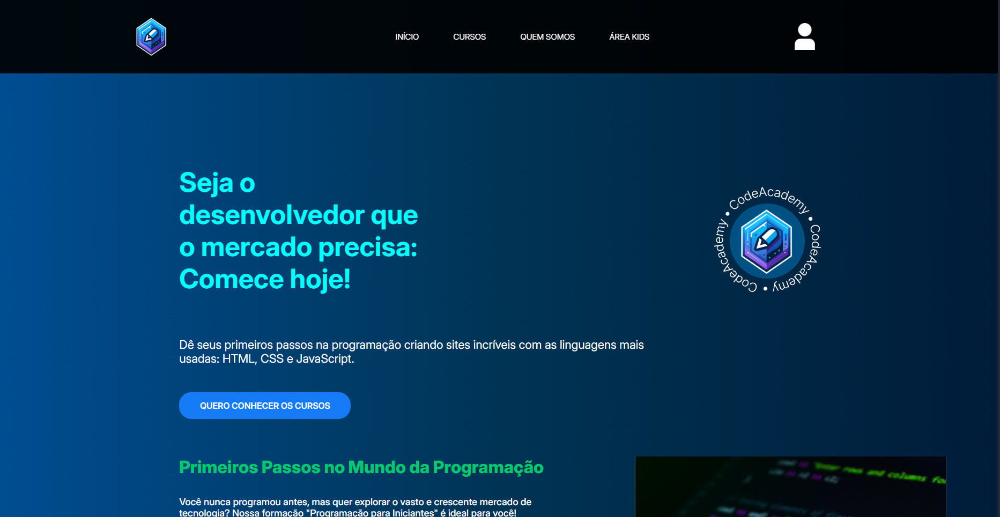
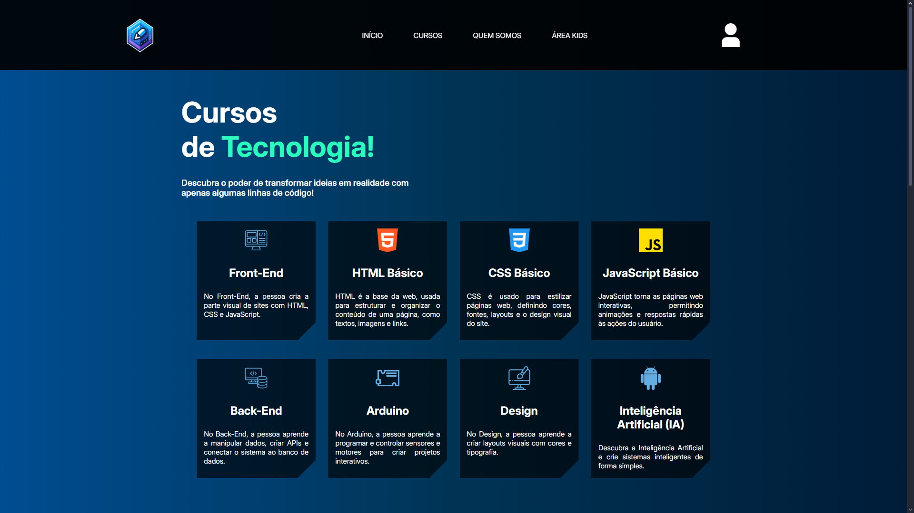
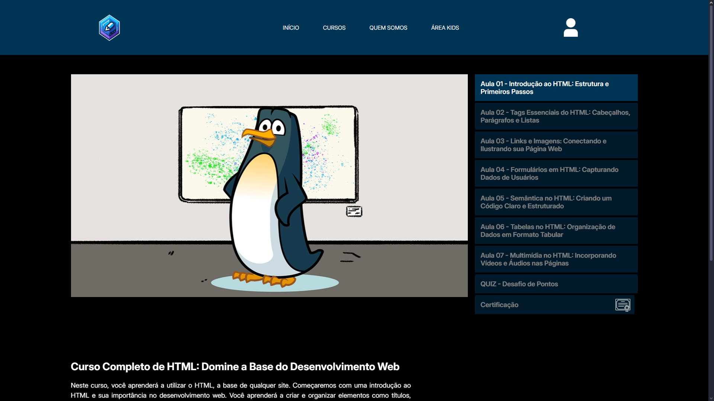
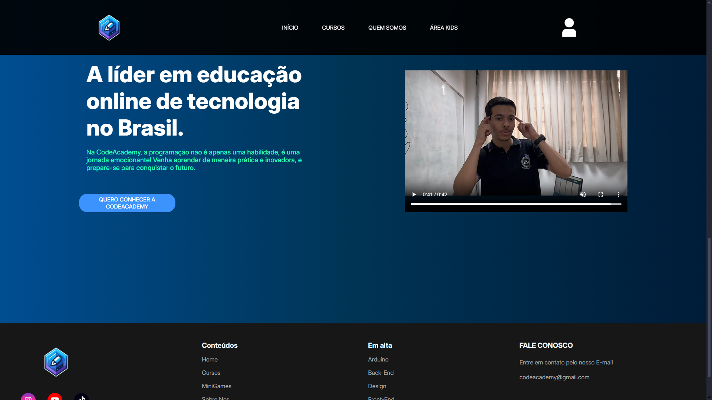
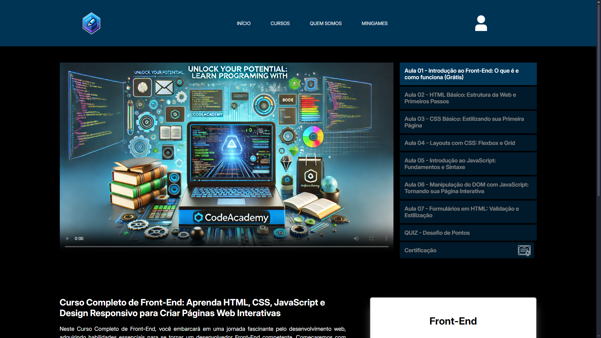

<h1>Code Academy</h1>
  

## Tópicos

 • <a href="#-sobre-o-projeto">Sobre o Projeto</a>  
 • <a href="#-tecnologias">Tecnologias</a>  
 • <a href="#-layout">Layout</a>  
 • <a href="#-funcionalidades">Funcionalidades</a>  
 • <a href="#-autor">Autor</a>  
 • <a href="#user-content--licença">Licença</a> 

## Sobre o projeto  

O CodeAcademy é uma plataforma de ensino de tecnologia que oferece cursos acessíveis para diversos públicos, desde iniciantes até profissionais da área. O projeto se destaca por disponibilizar conteúdos gratuitos e pagos a preços acessíveis, além de uma área dedicada ao ensino de programação para crianças.

## Tecnologias
<h2>📌 Front-end (Interface do Usuário)</h2>

▪ HTML5, CSS3 e JavaScript → Construção da interface responsiva e interativa.

▪ React.js → Framework utilizado para tornar a experiência do usuário mais dinâmica e eficiente.

▪ Figma → Usado para prototipação e design da plataforma antes da implementação.

<h2>📌 Back-end (Lógica da Aplicação)</h2>

▪ Firebase Authentication → Implementação do sistema de login e segurança dos usuários.

<h2>📌 Outras Tecnologias e Ferramentas</h2>

▪ Git e GitHub → Controle de versão e colaboração no desenvolvimento.

▪ Adobe → Utilizado para criar vozes personalizadas para conteúdos infantis.
  

## Layout

💻 Algumas telas da Aplicação Web!

  

  <h2 align=center>Cursos</h2>
  
   <h2 align=center>Área Kids</h2>
  
   <h2 align=center>Videos Explicativos</h2>
  
  <h2 align=center>Área do Curso</h2>
  

## Funcionalidades

<h2>🎓 Gestão de Cursos</h2>

✅ Catálogo com cursos gratuitos e pagos.

✅ Aulas em vídeo, exercícios práticos e materiais complementares.

✅ Certificados de conclusão para os alunos.

<h2>👶 Área Kids (Educação Infantil em Tecnologia)</h2>

✅ Interface lúdica e gamificada para crianças.

✅ Conteúdos interativos que ensinam programação de forma divertida.

✅ Suporte a narração com voz gerada por IA (Adobe).  

<h2>🔑 Autenticação e Segurança</h2>

✅ Login via Firebase Authentication (e-mail/senha, Google, redes sociais).

✅ Recuperação de senha integrada.

# Entre em contato

**Linkedin**: [LinkedIn](https://www.linkedin.com/in/jonathan-rubens-60975628a/)

Desenvolvido por **Jonathan Rubens** 👋🏻
